## Vehcile Detection
### Project to identify and mark moving cars on a given mp4 video. Detection is done frame by frame and video is reassmbled.
---

**Vehicle Detection**
Just like any image detection we have option to use CNNs. This project is focused primarily use features extracted via HOG and train a Linear SVM classifier

Following are the steps to achieve the outcome:

## 1 Collect lot of data : 

In our case we collected lot of Car and Non-car images which are related to road

Vehicle and Non-vehicle

https://s3.amazonaws.com/udacity-sdc/Vehicle_Tracking/vehicles.zip

https://s3.amazonaws.com/udacity-sdc/Vehicle_Tracking/non-vehicles.zip

http://www.gti.ssr.upm.es/data/Vehicle_database.html

http://www.cvlibs.net/datasets/kitti/

https://github.com/udacity/self-driving-car/tree/master/annotations

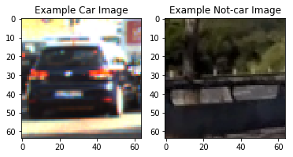

## 2 Analyse data: 

Check distribution of data. ML is all garbage in , garbage out. Quality of data is very important.Hence, it is very importatn we anaylze its distribution and what features we can extract. Data should be sufficiently distributed for randomizing selection for training and testing.

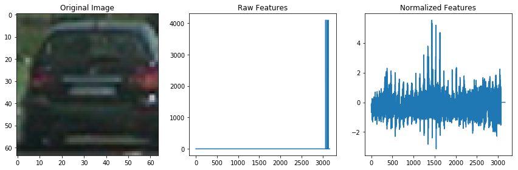

## 3 Features: 

In our case, we are recommended to use Histogram Of Oriented Gradients (HOG). Following image was generated with HOG parameters of

orient = 9
pix_per_cell = 8
cell_per_block = 2

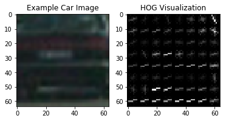

I experimented to check find the best ones that can identify cars.
orient = 1
pix_per_cell = 5
cell_per_block = 3

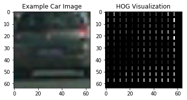

After trying various options, I prefered to use RGB and (orient = 9, pix_per_cell = 8, cell_per_block = 2) for my first run.

## 4 Classifier :

We will be using linear SVM
I trained the linear SVM with total of 4932 features - Spatial, Hist and HOG combined. Data set was randomized and split with 80/20 rule for training and testing. It achieved 98% accuracy. 

Note: 4932 features did give lot of false positives , I later moved up to use 'ALL' HOG features. That bumped the # of features to 8460. Especially, cars in test4 image were not getting recogonized. After adding 'ALL' features, I could see cars getting recogonized. 

## 5 Pipeline : 
I took the test images and generated the following heat maps and later run the video using the built pipeline.

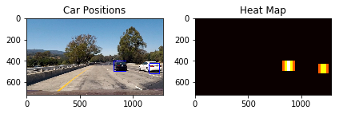

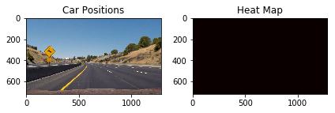

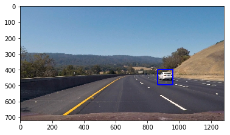

PS: Due to single frame, image is not coming up in heat map.

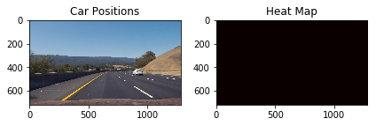

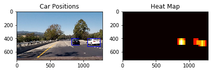

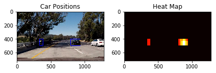

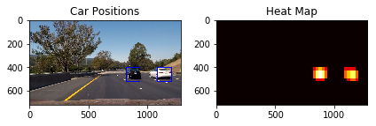

https://youtu.be/uamuuHZaQvo

## 5 Challanges:
1. HOG Feature selection
2. Timing: Getting accuracy with-in limited time.

## 6 Improvements: 
1. Sliding Window : Experiment if it can be used with other objects on road on given image. Like identify Trees, Pedestrians, Trucks etc. 
2. Real-Time: Experiment if we can use this on real time basis. How much lag would it be before cars are getting recogonized.
